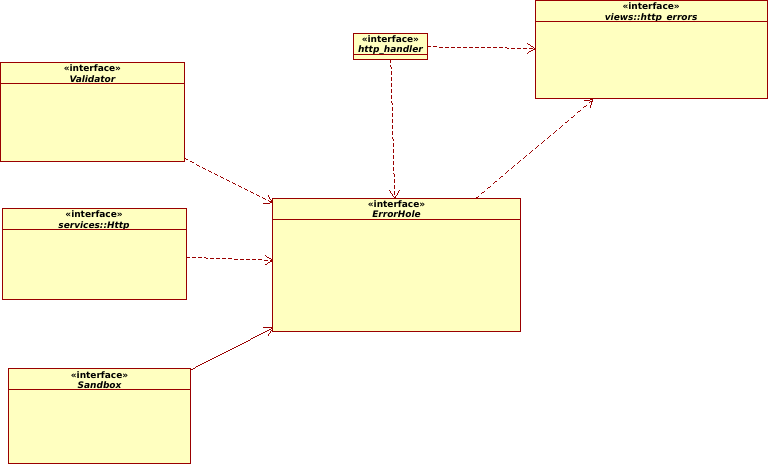

# Error cases

## Case A: http handler explicitly reports an error and sends a body with body explanation
Any http handler MAY explicitly report an error like this:
```
handler() {
    res.status(500).send("some error has happend");
}
```


## Case B: Http handler throws an exception or assert(assertion is also an exception)
Any http handler MAY throw an exception or assert like this:
```
handler() {
    if (somethinGoesWrong) {
        assert(false);
    } else if (somethinGoesBad) {
        throw(error);
    }
}
```


## Case C: App FW can find that incoming params don't fit into expected regexps and retuns http error 400
Here is a validator which performs validation and returns an error if any.\
yeap_app_server/lib/validators/validate.js\
This validator already explisitly sends 400 with explanation like this:
```
    res.status(400).send(errorExplanation);
```


## Case D: App FW SHALL handle 404 error
yeap_app_server/lib/services/Http.js installs very last middle-ware into express mw chain and return 404 with hardcoded explanation:
```
_handle404 (req, res, next) {
    res.status(404).send('Can\'t find requested url:' + req.originalUrl);
}
```


## Case E: App FW can handle an interanl error and shall report 5xx error


# Requirements
* Here shall be a common point for handling/reporting errors to avoid spreading err-handling code across the whole codebase.\
  Any place shall forward error hadling to that point.
* Here shall be a way to assign bodys/views for any/every http error
* Http error views shall be preneted as a set of ejs views


# Plan
* Create a single "entry point" for reporting errors: ErrorHole\
  Every source of error shall use that ErrorHole for reporting errors\
  Error sources:
    * validators
    * _404handler
    * http handlers 
    * sandbox
* Here is a sanbox, sandbox shall catch any exception and try to report it to the client, hanling 5xx errors
* Here shall s set of ejs views meant every http error code, shall be a default views - to be used if no view for a cetain http error is defined.
  let say 404 and 400 vies are defined and 4xx is meant as default view for other errors.


<p align="center">
    
</p>

